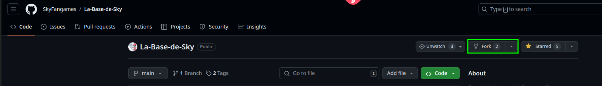
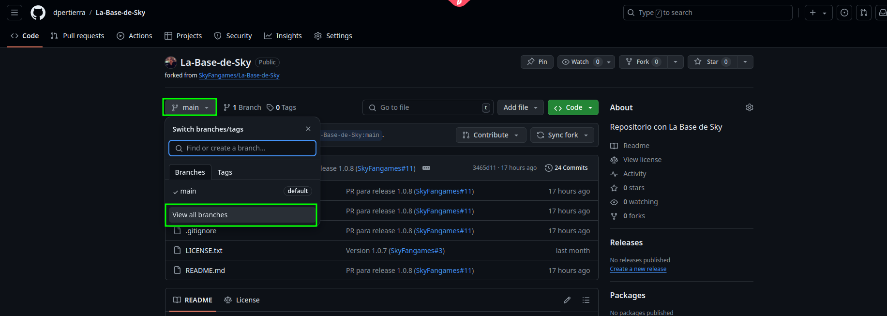
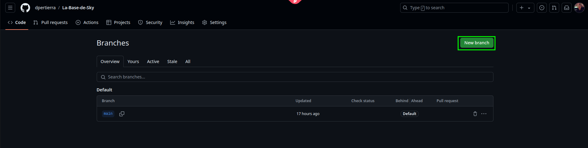
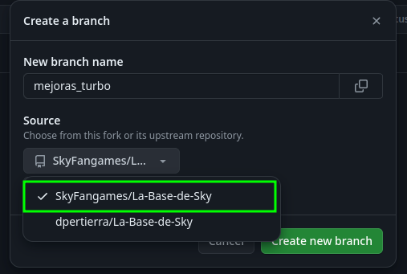
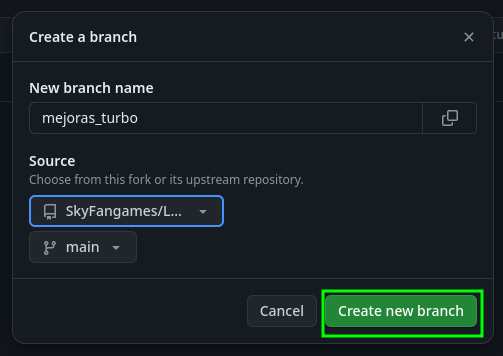
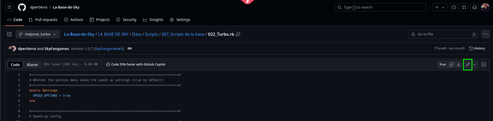
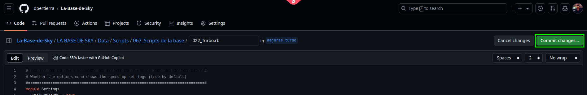
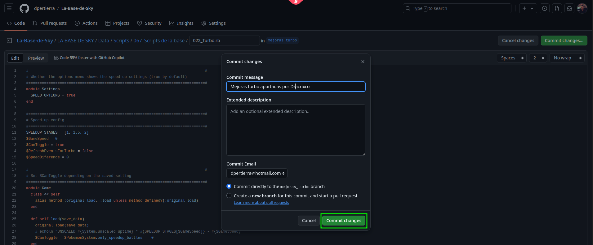
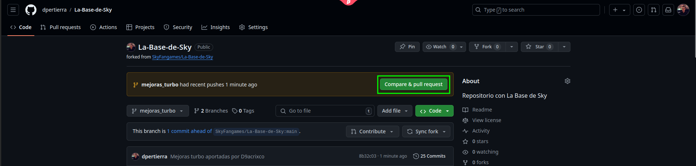
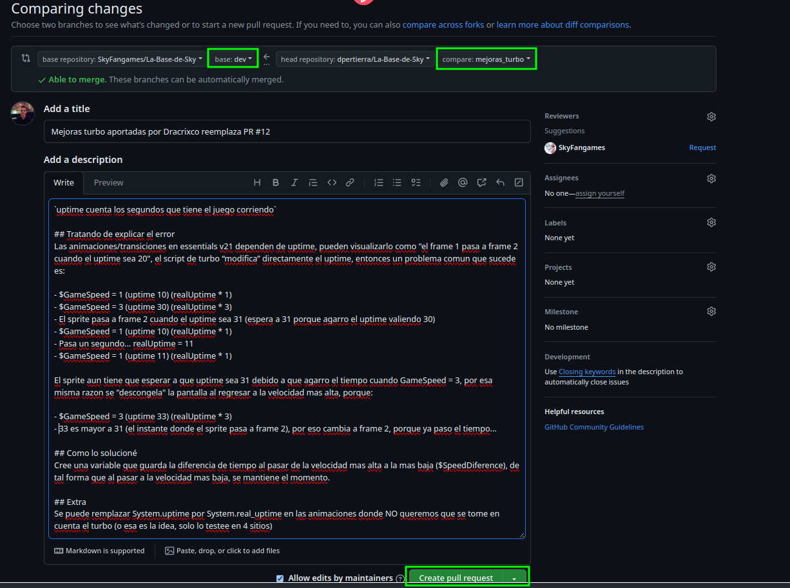

# COMO CONTRIBUIR A LA BASE DE SKY

1. Crear un fork del proyecto en GitHub

2. Crear una branch para los cambios, en mi caso voy a crear una nueva branch para las mejoras del turbo aportadas por Dracrixco

3. Ahora, si son cambios menores, los pueden hacer desde la misma página de GitHub. Pero lo más cómodo suele ser clonar el repo y hacerlo desde un IDE, como vscode. Para la simplicidad del tutorial lo voy a hacer desde la página de GitHub

4. Al terminar de hacer sus cambios hacen click en Commit changes...

5. En el home de su repo verán un cartel amarillo de que su branch tuvo cambios y un botón verde que dice Compare & pull request. Hacen click en ese boton

6. Se aseguran que el base sea dev y el compare sea la branch que crearon en el paso 2

Y listo una vez hecho esto su PR estará creada y Sky o yo(Diego/DPertierra) podremos analizarla y si está todo bien mergearla. Si hay algo que no nos quede claro podremos pedirles sobre la misma que nos expliquen un poco mas o que le hagan cambios si vemos algo que no está del todo bien.

> [!WARNING]
> Que creen una PR no significa que esta siempre vaya a ser aprobada, si es una corrección de un error y está bien hecha casi seguro que si, se aprobará.
>
> Pero si es una funcionalidad nueva o mejora veremos que tanto aporta y decidiremos si se aprueba o no.
>
> Todas las PRs que se haga directo a la branch main serán rechazadas.
